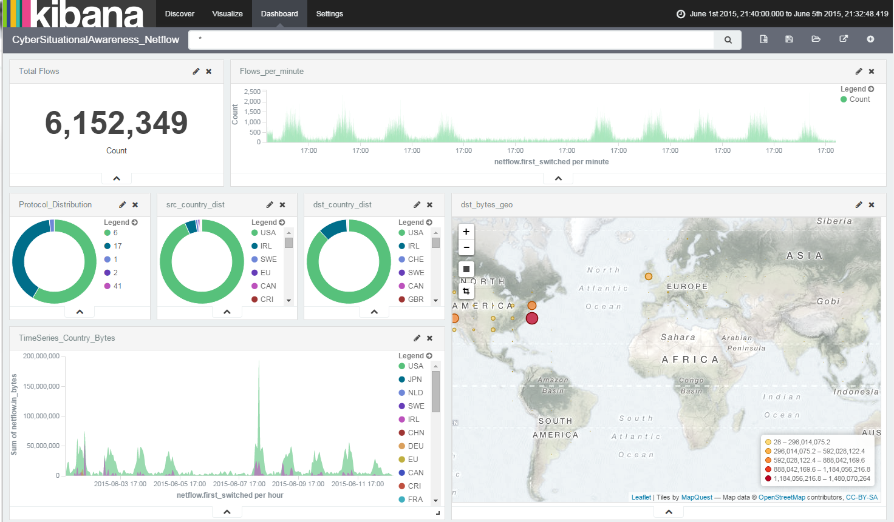

# Netflow Analytics

## Data Pipelines
There are two folders one for [traditional Hadoop based ETL (MapReduce, Spark, etc.)](./Hadoop) and one for using [Elasticsearch for the streaming ingest](./Elasticsearch). Currently I have constructed a streaming ingest of Netflow with Elasticsearch. Long term store in HDFS is accomplished through the Elasticserach Hadoop connector.

### Elasticsearch ELK
ELK stands for Elasticsearch-Logstash-Kibana. The ingest for Netflow is very straightforward with Logstash since it has a filter/codec to ingest the binary data stream from a Netflow Collector (or replay usng nfreplay). Data enrichments such as labeling IPs within a CIDR block (internal, reserved, web, office location) can also easily be done using the Logstash "cidr" filter.
